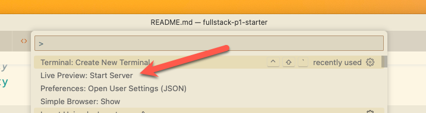
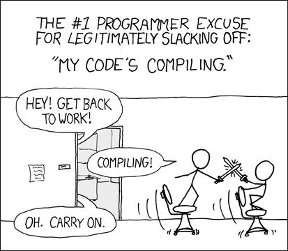

# Project 1

## Overview

In this project we are going to review the layout that we will be using for the
first half of the semester. This project is all set up to make it easy to write
and debug HTML, CSS, and Javascript. In this project you will be installing all
the required tools and testing your setup with a small website.

I have provided a **Video Walkthrough**(Linked Below) to help you have a
deeper understanding of the material. Please take the time to watch it as it
will likely answer all your questions.

## Project links

* [Project Walkthrough (Video)](https://youtu.be/RgsHU7tjzBo)
* [Cloning a Project (Video)](https://www.youtube.com/watch?v=fiPsHGi3Z_s)
* [Grading Rubric](https://shanepanter.com/cs208/grading-rubric.html)

## Task 0 - Install dev tools

Before we can start developing applications we need to make sure we have a fully
functional developer environment. We will be using VSCode as our editor, Google
Chrome as our browser, and NodeJS as our backend environment. Getting all the
tools setup and configured can take some time so make sure and start this as
early as possible so if you hit any snags you can get help before the due date
passes 😃.

* [Install VSCode and Git](https://shanepanter.com/teaching/vscode-tips-and-tricks.html)
* Install [NodeJS](https://nodejs.org/en/download)
* **Reboot your computer**! Don't skip this step!
* Read about [terminal basics](https://code.visualstudio.com/docs/terminal/basics)

## Task 1 - Clone this repository

If you are reading this on Github then the first step is to clone this
repository to your local computer so you can start working on the assignment!
You can read the [official documentation](https://code.visualstudio.com/docs/sourcecontrol/github#_cloning-a-repository)
on how to clone a repository. Additionally, I have created a [Video
Walkthrough](https://www.youtube.com/watch?v=fiPsHGi3Z_s) showing the process.

Once you have the repository cloned you can move on to the next task.

## Task 2 - Run the Website

In this class we will be developing our websites without the use of frameworks.
This will allow you to understand what is going on under the hood instead of
just relying on code that someone else has written.

We will use a really handy VSCode plugin to run our site. Install the [Live
Preview](https://marketplace.visualstudio.com/items?itemName=ms-vscode.live-server)
built in web server. There are several cool features of the development server
that will make your life easier when authoring web pages. The development server
will reload your browser window when it detects changes. This means you can stay
in your editor, make changes to your HTML, CSS, or javascript files and those
changes will automatically be reflected in the browser. Once you have the
live server installed you can view your site with the preview button in VSCode.



## Task 3 - Run the tests

Now let's update our website and then run the instructor provided tests.

* First open up a [terminal](https://code.visualstudio.com/docs/terminal/basics)
  and type the commands below to make sure everything is installed and run the
  provided tests.

```bash
npm install
npm test
```

* You should see a bunch of failing tests that look similar to what is shown

```bash
# Subtest: /Users/shane/repos/fullstack-p1-starter/test/test.js
not ok 2 - /Users/shane/repos/fullstack-p1-starter/test/test.js
  ---
  duration_ms: 220.133833
  failureType: 'subtestsFailed'
  exitCode: 1
  stdout: |-
    TAP version 13
    # Subtest: title is not empty
    not ok 1 - title is not empty
      ---
      duration_ms: 1.198833
      failureType: 'testCodeFailure'
      error: |-
        Expected values to be strictly equal:
        + actual - expected
        + ''
        - 'Hello World'
      code: 'ERR_ASSERTION'
      stack: |-
        TestContext.<anonymous> (file:///Users/shane/repos/fullstack-p1-starter/test/test.js:16:12)
        Test.runInAsyncScope (node:async_hooks:203:9)
        Test.run (node:internal/test_runner/test:511:25)
        Test.start (node:internal/test_runner/test:438:17)
        test (node:internal/test_runner/harness:129:18)
        file:///Users/shane/repos/fullstack-p1-starter/test/test.js:14:1
        ModuleJob.run (node:internal/modules/esm/module_job:193:25)
        async Promise.all (index 0)
        async ESMLoader.import (node:internal/modules/esm/loader:530:24)
        async loadESM (node:internal/process/esm_loader:91:5)
```

* Replace the `<body>` tag in **index.html** with the following.

```html
<body>
  <h1>HTML Rocks!</h1>
  
  <script type="module" src="js/main.js"></script>
</body>
```

* Now rerun the tests again and everything should be passing!

Assuming everything is working correctly you should see your webpage update
without having to hit the refresh button 😊. If you didn't see your website
update in the browser make sure your live preview is running.


## Task 4 - Testing

For each project you will be given a set of tests that you should run to check
your work. Passing all the instructor provided tests **DOES NOT** guarantee that
you will get an A+, only that your project meets the absolute bare minimum of
what is expected. You will need to supplement the tests with your own testing to
ensure your programs are correct. With that said, lets write our own tests. Open
up the file **test-student.js** and add in the code shown below. Then open up
the file **index.html** and update the title tag to say Hello world.

```javascript
test('title is not empty', (t) =>{
    const title = dom.window.document.title;
    assert.equal(title, 'Hello World');
});
```

Now when you run your tests you should see everything passing 😃 including the
new test that you wrote.

```bash
shane|(master *%=):fullstack-p1-starter$ npm test

> web-dev@0.0.1 test
> node --test

TAP version 13
# Subtest: /Users/shane/repos/fullstack-p1-starter/test/test-student.js
ok 1 - /Users/shane/repos/fullstack-p1-starter/test/test-student.js
  ---
  duration_ms: 220.080792
  ...
# Subtest: /Users/shane/repos/fullstack-p1-starter/test/test.js
ok 2 - /Users/shane/repos/fullstack-p1-starter/test/test.js
  ---
  duration_ms: 217.277584
  ...
1..2
# tests 2
# pass 2
# fail 0
# cancelled 0
# skipped 0
# todo 0
# duration_ms 223.716291
```

## Task 5 - Debugging Javascript

We are going to make a few small modifications to the starter code and then make
sure we can use the built in debugger for VSCode! Generally speaking it doesn't
make much sense to single step through your HTML or CSS code, but Javascript
code can be debugged just like any other programming language.

* First, modify the loaded function as shown below.

```javascript
function loaded() {
    let foo = 1;
    let bar = 2;
    let foobar = foo + bar;
    console.log("Loaded main.js: foo + bar = " + foobar);
}
```

* Second follow the steps below to debug the loaded function

1. Run your development server with `Live Preview: Start Server`
2. Open the file **js/main.js**
3. Open the built-in [debugger](https://code.visualstudio.com/docs/editor/debugging)
4. Click on the debug icon in VSCode and then click the big green arrow that
   says "Debug Website" to start a debugging session.
5. Set a breakpoint on the variable foo and refresh.
6. Step through the code to see the changes

If all goes well you can now debug your Javascript code!

## Task 6 - Documentation

All JavaScript code need to be properly documented with
[JSDoc](https://jsdoc.app/) in this class.  Read the short [getting started
guide](https://jsdoc.app/about-getting-started.html) for all the details in
using JSDoc. Write documentation for the loaded function in the main.js file.

## Task 7 - Complete the Retrospective

Once you have completed all the tasks open the file Retrospective.md and complete
each section that has a TODO label. Reference the grading rubric for details on how
this will be graded.

## Task 8 - Add, Commit, Push your code

Once you are finished you need to make sure that you have pushed all your code
to GitHub for grading! The Video walk through linked in the beginning of this
document will show you how to accomplish this task.

## Acceptance Criteria

* You have installed all the dev tools and can run the website
* All the instructor provided tests are passing
* You have written at least 1 test of your own
* You have pushed your code to github for grading
